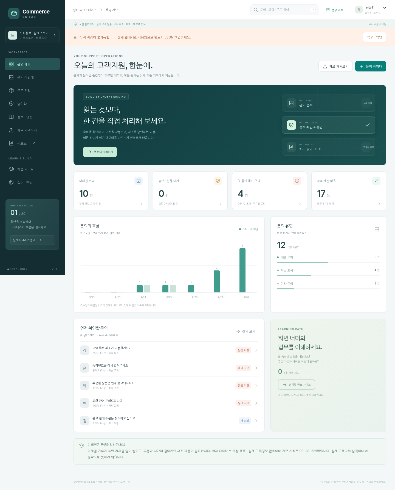

# Commerce CS Lab · 고객지원 실습 앱

**비즈니스 모델 01 / 30 · 쇼핑몰 고객문의 관리**  
React + TypeScript 소스 프로젝트와 설치 없이 열어보는 단일 HTML 실행본입니다.

> 목표는 ‘챗봇처럼 보이는 화면’이 아니라 **주문 → 문의 → 판단 → 승인 → 결과 → 이력**을 직접 조작하며 이해하는 것입니다. 이 저장소는 상용 고객센터가 아닌 **로컬 학습용 제품 v1.0.0**입니다. 기존 특정 서비스의 코드를 복제한 제품이 아닙니다.



## 1. 먼저 앱을 열어보세요

압축을 풀고 **`preview.html`을 Chrome 또는 Edge에서 여세요.** 파일 자체에 실행 코드와 스타일이 들어 있습니다. CDN, 회원가입, API 키, npm 설치 없이 체험합니다.

- 가상 주문 12개와 가상 문의 12개가 준비됩니다. 기존 브라우저 자료가 있으면 그 자료를 먼저 불러옵니다.
- **학습 가이드**에서 첫 시나리오를 하나만 선택하세요. 각 시나리오는 기존 자료를 지우지 않고 새로운 주문과 문의를 만듭니다.
- **상단의 ‘상담원’ 선택을 ‘관리자’로 바꾸면** 승인·정책·자료 반영을 실습할 수 있습니다. 이 선택기는 진짜 로그인이 아닙니다.
- `index.html`은 개발용 소스 진입점입니다. 더블클릭 실행 대상은 **`preview.html`**입니다.
- 브라우저 저장이 불가능하면 경고를 표시하고 현재 탭에서만 동작합니다. 작업 종료 전 **설정 · 백업 → 전체 JSON 백업**을 이용하세요. 직접 연 파일의 저장은 브라우저마다 다를 수 있습니다.
- 이 버전에는 삭제 버튼을 두지 않았습니다. 중요한 자료는 백업하고 가상 자료만 다루세요. 전체 초기화에는 확인 문구를 직접 입력해야 합니다.

## 2. 무엇을 만들었나요?

| 화면 | 직접 작동하는 기능 |
|---|---|
| 운영 개요 | 실자료 기준 미해결·승인 대기·첫 응답 지연·해결 비율, 최근 7일 차트, 우선 문의 이동 |
| 문의 작업대 | 검색·유형/상태 필터, 새 문의, 담당자·우선순위, 주문 연결, 메모, 초안, 모의 답변, 해결/다시 열기, 인계 |
| 주문 관리 | 검색·상태 필터·CSV 내보내기, 주문 상세, 전진 방향 물류 상태 변경, 버전 갱신 |
| 승인함 | 요청·승인·반려·실행 분리, 관리자 역할 제한, 중복 활성 승인 방지, 실행 직전 재검사, 중복 실행 차단 |
| 정책 · 답변 | 취소 검토 범위·금액·첫 응답 목표·안내 문구, TXT 안내 문구 불러오기, 정책 버전 관리 |
| 자료 가져오기 | 주문/문의 CSV, 미리보기, 필수 열·값·중복 검사, 오류 보고서, 전체 파일 검증 후 신규 행 반영 |
| 리포트 · 이력 | 기간별 지표, 작업 이력, 로컬 발신함, 검색·페이지 이동·CSV 내보내기 |
| 학습 가이드 | 6개 시나리오, 독립 연습 자료 생성, 이해 질문, 직접 체크하는 학습 진도 |
| 설정 · 백업 | 전체 JSON 내보내기, 구조 검사, 복원 미리보기, 확인 후 교체, 손상된 원본 보존, 초기화 |

**답변 초안은 규칙·양식 기반입니다. AI가 생성했다고 표시하지 않습니다.**
실제 이메일·문자 발송, 쇼핑몰 취소, 결제·환불, 실시간 배송 조회는 실행하지 않습니다.

## 3. 첫 번째 완주: 취소 문의 한 건 처리

1. **문의 작업대**에서 `T-2001`(출고 전에 주문을 취소하고 싶어요)을 선택합니다.
2. **판단 근거**에서 주문 존재·이메일 일치·출고 전 상태·금액 한도·문의 유형을 확인합니다.
3. **취소 승인 요청 → 승인 요청 등록**을 누릅니다. 주문은 아직 취소되지 않습니다.
4. 상단 실습 역할을 **관리자**로 바꾸고 **승인함**에서 **검토 승인**합니다.
5. 별도의 **재검사 후 모의 실행**을 진행합니다. 앱 안의 주문만 ‘취소 완료 (모의)’로 바뀝니다.
6. 문의로 돌아와 **규칙 기반 초안 생성 → 모의 답변 기록 → 해결 처리**합니다.
7. 리포트의 숫자와 작업 이력을 확인합니다. **실제 환불이 발생하지 않았다는 사실**도 설명해 보세요.

두 번째에는 승인 뒤 실행하기 전에 **주문 관리에서 같은 주문을 배송 중으로 변경**하세요. 재검사가 실행을 차단하는 이유를 확인하면 됩니다. 새로운 자료는 학습 가이드에서 만드세요.

## 4. GitHub에 올리기

권장 새 저장소 이름: **`vibecoding-business-01-customer-support`**

- 이 프로젝트는 아직 사용자의 GitHub에 업로드되어 있지 않습니다. 파일을 제공한 상태입니다.
- ZIP 자체 하나를 올리는 것이 아니라 **압축을 푼 프로젝트 폴더의 내용**을 올립니다.
- 저장소 첫 화면에 `package.json`, `README.md`, `src/`, `AGENTS.md`가 보여야 합니다.
- 기존 오래된 저장소를 덮어쓰지 말고 새 저장소를 사용하세요.
- GitHub 웹의 **Add file → Upload files** 또는 GitHub Desktop을 사용할 수 있습니다. `.github/`, `.gitignore`, `.nvmrc` 등 숨김 파일이 빠지지 않았는지 확인하세요.
- 실제 고객 CSV, 개인 작업 백업, API 키, `node_modules/`는 올리지 마세요.
- 저장소 공개/비공개는 직접 결정하세요. 처음부터 공개할 필요는 없습니다.

자세한 절차는 [GITHUB_GUIDE.md](docs/GITHUB_GUIDE.md)를 보세요. 저장소 업로드와 서비스 배포는 별개입니다.

## 5. 소스 수정 실행

Node.js **22.12 이상**을 사용합니다. 인터넷이 되는 개발 환경에서 프로젝트 폴더를 열어 실행하세요.

```bash
npm install
npm run dev
```

터미널에 표시되는 로컬 주소로 접속합니다. 첫 설치에서 생성되는 `package-lock.json`을 확인하여 Git에 커밋하세요. 이 배포본에는 네트워크 제약으로 확인되지 않은 잠금 파일을 임의로 만들지 않았습니다. 잠금 파일이 만들어진 이후에는 `npm ci`로 재현 가능한 설치를 권합니다.

```bash
npm run typecheck         # React 타입까지 포함한 전체 정적 검사
npm run typecheck:domain  # React 타입 패키지에 의존하지 않는 업무/자료 영역 검사
npm test                  # Node 내장 테스트 러너: 60개
npm run build             # 오프라인 실행 가능한 preview.html + dist/index.html 생성
npm run preview           # 위 실행본을 localhost:4173에서 열기
npm run build:vite        # 표준 Vite 빌드 → dist-vite/
```

**주의: `npm run build`는 이 프로젝트의 단일 파일 빌더입니다.** Vite 빌드 명령은 `build:vite`로 분리했습니다. 단일 파일 빌더는 `vendor/react-runtime.js`의 고정 React 19.1.1 런타임을 이용합니다. 신규 외부 패키지·이미지 import·코드 분할은 자동으로 지원하지 않습니다. 확장 전에 [ARCHITECTURE.md](docs/ARCHITECTURE.md)를 읽으세요. `preview.html`을 직접 수정하지 말고 `src/`를 수정한 뒤 다시 빌드하세요.

## 6. 자동 검사와 배포

- `.github/workflows/ci.yml`: 설치 → 전체 타입 검사 → 60개 업무 테스트 → 단일 HTML 빌드 → Vite 빌드. 실패 시 배포 준비 완료로 간주하지 않습니다.
- `.github/workflows/pages.yml`: **수동 실행만** 하는 GitHub Pages 배포 예시. 설정에서 Pages 소스를 GitHub Actions로 선택한 뒤 실행합니다. 계정/저장소의 지원 조건에 따라 사용 가능 여부가 다릅니다. 배포는 직접 시험되지 않았습니다.
- `tests/browser_smoke.py`: 브라우저 실습 7개 묶음. Python Playwright가 필요합니다. [테스트 보고서](docs/TEST_REPORT.md)에 실제 실행 범위와 미확인 항목을 구분했습니다.

```bash
pip install playwright
playwright install chromium
npm run build
python tests/browser_smoke.py
```

`BASE_URL` 환경변수가 없으면 HTML을 메모리 페이지에 삽입해 시험하므로 브라우저 저장이 제한되는 **임시 저장 모드**일 수 있습니다. 실제 배포 URL에서 저장을 확인하려면 그 주소로 `BASE_URL`을 지정하세요.

## 7. Codex / Claude에게 다음 작업 넘기기

`AGENTS.md`와 `CLAUDE.md`에는 업무 규칙, 보안 경계, 테스트 명령, 점진적 수정 원칙이 있습니다.
[AI_NEXT_TASK.md](docs/AI_NEXT_TASK.md)를 채팅에 붙여 넣고 시작하세요. 이 파일이 실제 외부 도구와 연결을 생성하지는 않습니다.

**첫 요청은 새 기능보다 ‘저장소를 읽고 실행·검증 결과를 설명하기’입니다.** 설치와 현재 기능 검증을 마친 뒤 한 기능씩 확장하세요. 실제 백엔드를 연결하기 전에 인증, 접근 정책, 서버 재검사, 오류 복구를 설계해야 합니다.

## 문서 지도

- [BUSINESS_FLOW.md](docs/BUSINESS_FLOW.md): 사업의 대상, 비용 구조, 처리 흐름, 6개 학습 시나리오
- [FEATURE_MATRIX.md](docs/FEATURE_MATRIX.md): 작동 범위·대체 방식·제외 기능
- [ARCHITECTURE.md](docs/ARCHITECTURE.md): 소스 지도, 상태/저장 분리, 빌더 제약
- [DATA_MODEL.md](docs/DATA_MODEL.md): 테이블 후보, 상태 전이, 백업 검증
- [BACKEND_ROADMAP.md](docs/BACKEND_ROADMAP.md): 로그인·온라인 저장·연동으로 발전시키는 순서
- [TEST_REPORT.md](docs/TEST_REPORT.md): 실제 테스트와 미확인 항목
- [SECURITY.md](SECURITY.md): 로컬 실습과 운영 보안의 차이
- [samples/README.md](samples/README.md): 업로드 파일 양식
- [THIRD_PARTY_NOTICES.md](THIRD_PARTY_NOTICES.md): 포함된 React 런타임 라이선스·출처

## 공식 참고자료

확인 기준: 2026-09-29. 프로젝트 동작은 이 저장소 코드와 테스트를 기준으로 하며, 외부 제품의 최신 UI·요금과는 무관합니다.

- Vite: https://vite.dev/guide/
- GitHub 파일 업로드: https://docs.github.com/en/repositories/working-with-files/managing-files/adding-a-file-to-a-repository
- Codex 프로젝트 지침: https://developers.openai.com/codex/guides/agents-md/
- Claude Code 프로젝트 지침: https://code.claude.com/docs/en/memory
- 브라우저 저장 설명: https://developer.mozilla.org/en-US/docs/Web/API/Window/localStorage
